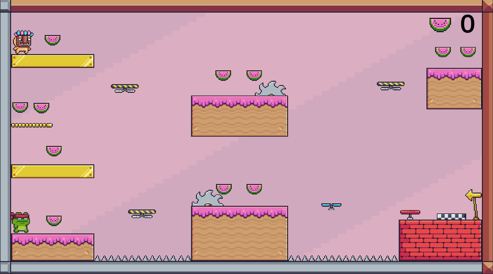

# 🎮 Plataforma Pixel Adventure

Um jogo 2D plataforma em pixel art desenvolvido na Unity, com foco em movimentação, obstáculos e mecânicas interativas.

---

## 🕹️ Sobre o jogo

Este projeto é um jogo de plataforma 2D onde o jogador precisa avançar pelo mapa desviando de perigos, utilizando mecânicas especiais e coletando itens para aumentar sua pontuação.

O jogo foi desenvolvido para praticar conceitos de programação, animação e level design em Unity.

---

## 📸 Screenshot

---

## ✨ Mecânicas implementadas

* ✅ Movimento do player
* ✅ Sistema de animações
* ✅ Tela de Game Over
* ✅ Inimigos
* ✅ Coletáveis para pontuação
* ✅ Serras como obstáculos/inimigos
* ✅ Trampolim
* ✅ Ventiladores que impulsionam o player com vento

---

## 🎯 Objetivo do jogo

Chegar ao final da fase sobrevivendo aos obstáculos e acumulando o máximo de pontos possível.

---

## 🎮 Controles

* **A / D** ou **← / →** → Movimento
* **Espaço** → Pular

---

## ⚙️ Tecnologias utilizadas

* Unity 2D
* C#
* Pixel Art
* Animator Controller

---

## 🚀 Como rodar o projeto

1. Clone ou baixe este repositório
2. Abra o projeto na Unity
3. Execute a cena principal

---

## 📌 Status do projeto

✅ Finalizado

---

## 👤 Autor

* Biel
